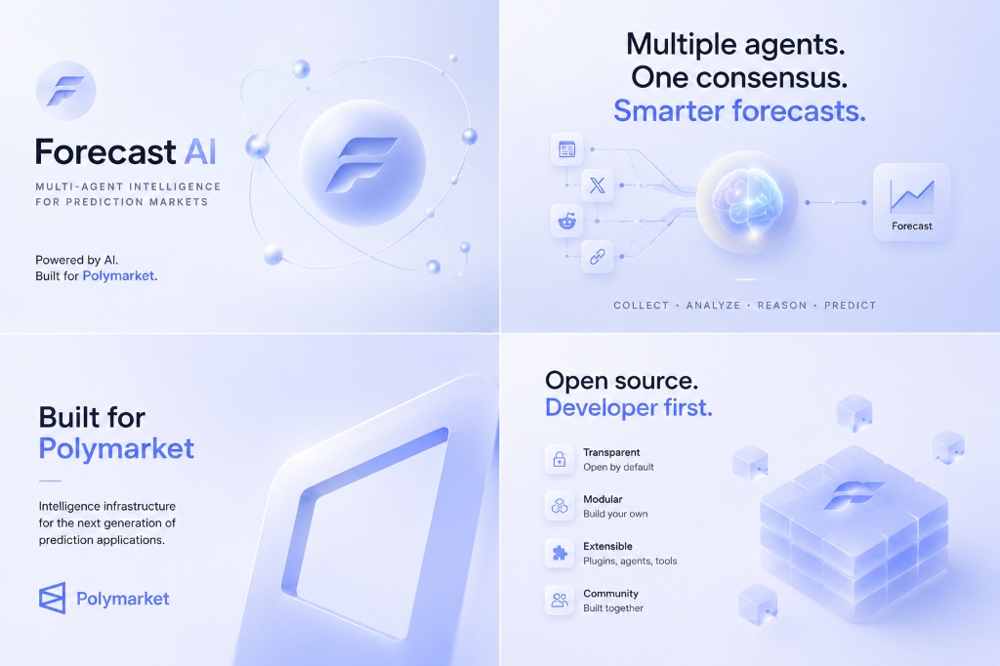
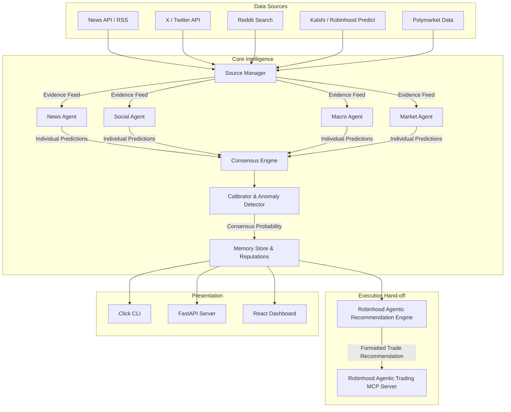

# 🔮 Forecast AI

<p align="center">
  
</p>

### Open-Source Multi-Agent Intelligence Infrastructure for Prediction Markets

[](#)
[](#)
[](#)
[](https://forecastagents.vercel.app/)
[](https://x.com/forecast_agents)

<p align="center">
  <b>🌐 Available in other languages:</b><br>
  <a href="assets/README_AR.md">العربية</a> | 
  <a href="assets/README_DE.md">Deutsch</a> | 
  <a href="assets/README_ES.md">Español</a> | 
  <a href="assets/README_FR.md">Français</a> | 
  <a href="assets/README_HI.md">हिन्दी</a> | 
  <a href="assets/README_IT.md">Italiano</a> | 
  <a href="assets/README_JA.md">日本語</a> | 
  <a href="assets/README_KO.md">한국어</a> | 
  <a href="assets/README_PT.md">Português</a> | 
  <a href="assets/README_RU.md">Русский</a> | 
  <a href="assets/README_VI.md">Tiếng Việt</a> | 
  <a href="assets/README_ZH.md">中文</a>
</p>

---

**Forecast AI is the open-source intelligence layer for Prediction Markets, enabling autonomous AI agents to continuously monitor the world, reason collaboratively, and generate explainable probability forecasts.**

Rather than querying a single LLM model, Forecast AI deploys specialized agents (News, Social, Reddit, Research, Macro, On-chain, and Market Agents) to gather evidence, evaluate outcomes, and run their forecasts. A **Consensus Engine** aggregates their analysis into a single, explainable probability estimate.

Trade recommendations are formatted for seamless hand-off to your personal **Robinhood Agentic Trading MCP** (`https://agent.robinhood.com/mcp/trading`) session.

---

## 📚 Documentation Index

For detailed guides and module specifications, see the [docs/](docs/) directory:

| Document | Description |
| :--- | :--- |
| [docs/agents.md](docs/agents.md) | Overview of specialized agents, roles, and instructions. |
| [docs/architecture.md](docs/architecture.md) | High-level module mapping and system boundaries. |
| [docs/consensus.md](docs/consensus.md) | Mathematical formulation of confidence weighting and calibration. |
| [docs/deployment.md](docs/deployment.md) | Docker build and container deployment guides. |
| [docs/examples.md](docs/examples.md) | Python library usage and integration code snippets. |
| [docs/kalshi.md](docs/kalshi.md) | Kalshi API client usage and Robinhood Predict market data mirroring. |
| [docs/memory.md](docs/memory.md) | Long-term memory storage, Brier scoring, and Bayesian reputation loops. |
| [docs/polymarket.md](docs/polymarket.md) | Read-only Polymarket Gamma and CLOB integration details. |
| [docs/providers.md](docs/providers.md) | Configuring LLM providers (OpenAI, Anthropic, Gemini, OpenRouter, Ollama). |
| [docs/robinhood_agentic.md](docs/robinhood_agentic.md) | Robinhood Agentic Trading MCP integration guidelines and safety model. |
| [docs/sources.md](docs/sources.md) | Source connectors (News, RSS, X/Twitter, Reddit, Blockchain, Kalshi). |

---

## 🏗 System Architecture



---

## 💡 Why Forecast AI

Traditional Large Language Models (LLMs) are insufficient for prediction markets for two main reasons:
1. **Information Staleness**: LLM training weights are static. Even with basic search tool integrations, they lack continuous monitoring capabilities and real-time context.
2. **Lack of Probabilistic Calibration**: Traditional LLMs are optimized for conversational chat rather than statistical forecasting. They do not naturally output well-calibrated event probabilities or account for information recency, bid-ask spreads, and liquidity metrics.

Forecast AI resolves this by deploying **collaborative multi-agent reasoning**. By isolating agents into distinct operational domains (e.g. a Macro Agent monitoring interest rates, a Market Agent looking at Kalshi and Polymarket orderbook depth and price spreads), the platform reduces cognitive bias, flags conflicting narratives, and aggregates probability signals using structured mathematical consensus formulas.

### Traditional LLM vs. Forecast AI

| Dimension | Traditional LLM | Forecast AI |
| :--- | :--- | :--- |
| **Agent Structure** | Single model response | Multiple domain-specialized agents |
| **Information Recency** | Static context window | Continuous real-time multi-market sources |
| **Probability Aggregation** | Conversational guess | Structured consensus math |
| **Explainability** | Black-box output | Clickable trace and evidence audit |
| **Execution Hand-off** | Manual copy-paste | Formatted for Robinhood Agentic Trading MCP |

---

## 🔮 Key Features

*   **Multi-Market Data Coverage**: Primary support for Kalshi market data (serving as the proxy for Robinhood Predict event contracts) combined with read-only Polymarket market data feeds.
*   **Robinhood Agentic Trading MCP Execution**: Formats consensus probability forecasts into structured trade action recommendations for personal execution via `https://agent.robinhood.com/mcp/trading`.
*   **Domain-Specific AI Agents**: Orchestrates specialized agents (News, Social, Reddit, Research, Macro, On-chain, and Market Agents) operating in parallel to produce isolated forecasts.
*   **Consensus & Calibration Engine**: Aggregates independent probability forecasts using a confidence-weighted consensus formula. Calibrates raw output probabilities closer to uncertainty limits (50%) when confidence is low.
*   **Modular Source Connectors**: Easily swappable source adapters for pulling context from News APIs, RSS feeds, X (Twitter) search streams, Reddit, Kalshi, and Polymarket.
*   **Long-Term Memory & Reputation System**: Logs forecast outcomes to `memory_data/` and updates agent reliability weights over time using a Bayesian calibration loop.

---

## 🛠 Installation

### 1. Core Editable Installation
Clone the repository and install the package in development mode:
```bash
pip install -e .
```

### 2. Optional Feature Extensions
Select optional feature extras defined in `pyproject.toml`:

- **Real-Time WebSocket Support**:
  ```bash
  pip install -e ".[ws]"
  ```
- **On-Chain Signer Extensions**:
  ```bash
  pip install -e ".[onchain]"
  ```
- **Development & Testing Suite**:
  ```bash
  pip install -e ".[dev]"
  ```
- **Combined All Extensions**:
  ```bash
  pip install -e ".[ws,onchain,dev]"
  ```

---

## 🚀 Quick Start

### 1. Run the Interactive Configuration Wizard
Configure your LLM provider and market API settings:
```bash
forecast setup
```

### 2. Run a One-Shot Consensus Forecast
Compute a probability forecast directly from the CLI:
```bash
forecast predict "Will the Federal Reserve cut interest rates in September?"
```

### 3. Generate a Robinhood Agentic Trading Recommendation
Format a forecast into an MCP-ready action prompt:
```bash
forecast recommend "Will the Federal Reserve cut interest rates in September?"
```

### 4. Start the Surveillance Pipeline and API Server
Launch automated market watching loops and the FastAPI server:
```bash
forecast run --category macro
```

---

## 💻 Using Forecast AI as a Python Library

Incorporate `ForecastPipeline` directly into your Python trading systems or research applications:

```python
import asyncio
from forecast_ai.config import ForecastConfig
from forecast_ai.pipelines.forecast import ForecastPipeline

async def main():
    # Instantiate configuration (loads ~/.forecast_ai/config.yaml or defaults)
    config = ForecastConfig()
    
    # Initialize pipeline with active agents and sources
    pipeline = ForecastPipeline(config)
    
    # Execute multi-agent forecast
    question = "Will Ethereum gas fee average stay below 20 Gwei in Q3?"
    result = await pipeline.run_forecast(question, market_id="eth_gas_q3")
    
    print(f"Consensus Probability: {result.probability * 100:.1f}%")
    print(f"Consensus Confidence:  {result.confidence.score * 100:.1f}%")
    print(f"Reasoning Summary: {result.metadata.get('summary_reasoning')}")

if __name__ == "__main__":
    asyncio.run(main())
```

---

## 🖥️ CLI Command Reference

Full command reference implemented in `forecast_ai/cli/main.py`:

| Command | Arguments / Flags | Description |
| :--- | :--- | :--- |
| `forecast setup` | None | Runs the interactive step-by-step configuration wizard. |
| `forecast predict` | `<query>` `--market-id <id>` | Runs a one-shot multi-agent consensus forecast. |
| `forecast recommend` | `<query>` `--market-id <id>` | Formats a forecast into a Robinhood Agentic MCP trade recommendation. |
| `forecast run` | `--category <cat>` `--no-server` | Launches market watching loops and FastAPI server on port 30000. |
| `forecast watch` | `--category <cat>` `--interval <sec>` | Runs standalone market watching loops without starting the API server. |
| `forecast market` | `<slug>` | Inspects metadata, liquidity, and orderbook depth for a Polymarket slug. |
| `forecast sources` | None | Lists all registered data sources (News, RSS, Twitter, Reddit, Blockchain, Kalshi). |
| `forecast agents` | None | Displays status (ENABLED/DISABLED), reliability weights, and providers for all 7 agents. |
| `forecast providers` | None | Lists configured LLM providers (OpenAI, Anthropic, Gemini, Ollama, OpenRouter). |
| `forecast server` | None | Runs only the FastAPI HTTP server on the configured host and port. |

---

## ⚙️ Configuration Reference

Configuration is managed via dataclasses in `forecast_ai/config.py` and saved to `~/.forecast_ai/config.yaml` by `ConfigStore`:

### Config Dataclasses & Default Values

*   **`ProviderConfig`**: Settings for LLM backends (`provider`, `api_key`, `api_base`, `model_id`, `temperature`, `max_tokens`).
*   **`PolymarketConfig`**: Read-only market data URLs (`gamma_api_url: "https://gamma-api.polymarket.com"`, `clob_api_url: "https://clob.polymarket.com"`).
*   **`KalshiConfig`**: Kalshi REST API endpoints (`api_base_url: "https://api.elections.kalshi.com/trade-api/v2"`, `api_key`).
*   **`RobinhoodAgenticConfig`**: Execution MCP settings (`mcp_endpoint: "https://agent.robinhood.com/mcp/trading"`, `enabled: False`).
*   **`AgentSettings`**: Agent routing and consensus parameters (`enabled: True`, `provider`, `temperature: 0.3`, `max_sources_to_query: 5`, `weight: 1.0`).
*   **`ConsensusConfig`**: Calibration formulas (`min_evidence_score: 0.3`, `uncertainty_penalty: 0.1`, `default_agent_weight: 1.0`, `calibration_alpha: 0.05`).
*   **`MemoryConfig`**: Persistent storage (`store_dir: "memory_data"`, `max_history_entries: 1000`, `enable_reputation_updates: True`).
*   **`ServerConfig`**: API server settings (`host: "0.0.0.0"`, `port: 30000`, `api_key`).

---

## 🧠 Intelligence Layer (`forecast_ai/intelligence/`)

The intelligence module houses quantitative engines for evidence scoring, anomaly detection, and probability calibration:

- **`AnomalyDetector` (`anomaly_detection.py`)**: Monitors market liquidity, detects wide bid-ask spreads (>0.15), flags extreme pricing limits (<0.02 or >0.98), and detects conflicting narratives when agent forecast probabilities diverge by >0.40.
- **`EvidenceRanker` (`evidence_ranking.py`)**: Ranks gathered evidence by signal score and filters out low-relevance items below `min_score` (default 0.20).
- **`ProbabilityCalibrator` (`probability_calibration.py`)**: Adjusts raw probability towards maximum uncertainty (0.50) when confidence is low (`0.5 + (raw_prob - 0.5) * (0.3 + 0.7 * confidence)`), and computes Brier accuracy scores `(forecast_prob - outcome)^2`.
- **`SignalScorer` (`signal_scoring.py`)**: Computes signal strength based on source credibility weights (Polymarket: 1.0, Blockchain: 0.9, News: 0.8, RSS: 0.7, Twitter: 0.5, Reddit: 0.4) and exponential recency decay (3-day half-life).
- **`ReasoningTraceBuilder` (`reasoning.py`)**: Assembles step-by-step explainable reasoning traces documenting agent contributions, consensus steps, and resolved narrative conflicts.

---

## 💾 Memory & Bayesian Reputation System (`forecast_ai/memory/`)

Forecast AI maintains long-term state across market runs:

1. **Forecast Logging**: Historical predictions are written to `memory_data/forecasts.json`.
2. **Outcome Calibration**: When market outcomes resolve, `MemoryStore` calculates Brier error scores for each agent.
3. **Bayesian Reputation Updates**: Agent reliability weights are dynamically updated using a learning rate (`calibration_alpha = 0.05`) and saved to `memory_data/reputation.json`.
4. **Consensus Feedback Loop**: Updated reputation weights automatically feed back into `WeightedConsensusCalculator` (`consensus/weighted.py`) to increase the influence of historically accurate agents.

---

## 🎨 React Dashboard (`forecast-ui/`)

Forecast AI includes a live React dashboard interface:

```bash
# Navigate to UI directory and start development server
cd forecast-ui
npm install
npm run dev
```

The React dashboard connects to the local FastAPI server (started via `forecast run` or `forecast server`) to render live probability feeds, agent reasoning traces, and market watching updates.

---

## 🔬 Scripts & Benchmark Tools

- **`examples/forecast_demo.py`**: Minimal runnable example for executing forecasts programmatically.
- **`scripts/run_v03_benchmark.py`**: RL training and benchmark evaluation script featuring PRM scoring (via Bedrock Sonnet 4.6), skill evolution, and Tinker LoRA training on Qwen3-8B.
- **`scripts/run_openclaw_tinker_opd.sh`**: Shell script for launching On-Policy Distillation (OPD) training with teacher models.

---

## 🐳 Docker Deployment

Deploy Forecast AI as a containerized service:

```dockerfile
FROM python:3.11-slim
WORKDIR /app
COPY . .
RUN pip install -e ".[ws]"
EXPOSE 30000
CMD ["forecast", "run"]
```

Build and run:
```bash
docker build -t forecast-ai .
docker run -d -p 30000:30000 --name forecast-ai-server forecast-ai
```
For advanced deployment setups, see [docs/deployment.md](docs/deployment.md).

---

## ⛓ Integrations

Forecast AI natively integrates with:
*   **Prediction Markets**: Kalshi (Robinhood Predict proxy) and Polymarket (read-only)
*   **Execution Layer**: Robinhood Agentic Trading MCP (`https://agent.robinhood.com/mcp/trading`)
*   **LLM Providers**: OpenAI, Anthropic, Gemini, OpenRouter, Ollama

---

## 👥 Community & Support

*   **Website**: [forecastagents.vercel.app](https://forecastagents.vercel.app/)
*   **X (Twitter)**: [@forecast_agents](https://x.com/forecast_agents)
*   **GitHub**: [codebyollie/forecast-agents](https://github.com/codebyollie/forecast-agents)

---

## 🛡 License

Forecast AI is developed under the **Apache 2.0 License**.
