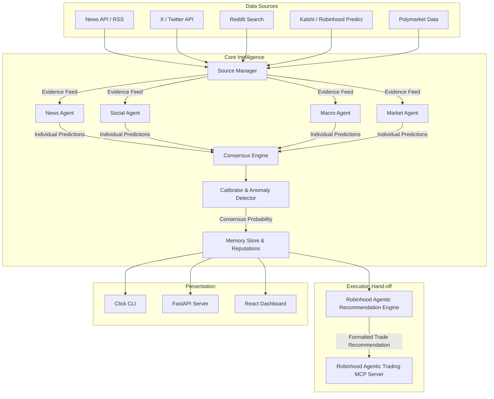

# 🔮 Forecast AI

<p align="center">
  
</p>

### Open-Source Multi-Agent Intelligence Infrastructure for Prediction Markets

[](#)
[](#)
[](#)
[](https://forecastagents.vercel.app/)
[](https://x.com/forecast_agents)

---

**Forecast AI is the open-source intelligence layer for Prediction Markets, enabling autonomous AI agents to continuously monitor the world, reason collaboratively, and generate explainable probability forecasts.**

Rather than querying a single LLM model, Forecast AI deploys specialized agents (News, Social, Reddit, Research, Macro, On-chain, and Market Agents) to gather evidence, evaluate outcomes, and run their forecasts. A **Consensus Engine** aggregates their analysis into a single, explainable probability estimate.

Trade recommendations are formatted for seamless hand-off to your personal **Robinhood Agentic Trading MCP** (`https://agent.robinhood.com/mcp/trading`) session.

---

## 🏗 System Architecture



---

## 💡 Why Forecast AI

Traditional Large Language Models (LLMs) are insufficient for prediction markets for two main reasons:
1. **Information Staleness**: LLM training weights are static. Even with basic search tool integrations, they lack continuous monitoring capabilities and real-time context.
2. **Lack of Probabilistic Calibration**: Traditional LLMs are optimized for conversational chat rather than statistical forecasting. They do not naturally output well-calibrated event probabilities or account for information recency, bid-ask spreads, and liquidity metrics.

Forecast AI resolves this by deploying **collaborative multi-agent reasoning**. By isolating agents into distinct operational domains (e.g. a Macro Agent monitoring interest rates, a Market Agent looking at Kalshi and Polymarket orderbook depth and price spreads), the platform reduces cognitive bias, flags conflicting narratives, and aggregates probability signals using structured mathematical consensus formulas.

### Traditional LLM vs. Forecast AI

| Dimension | Traditional LLM | Forecast AI |
| :--- | :--- | :--- |
| **Agent Structure** | Single model response | Multiple domain-specialized agents |
| **Information Recency** | Static context window | Continuous real-time multi-market sources |
| **Probability Aggregation** | Conversational guess | Structured consensus math |
| **Explainability** | Black-box output | Clickable trace and evidence audit |
| **Execution Hand-off** | Manual copy-paste | Formatted for Robinhood Agentic Trading MCP |

---

## 🔮 Key Features

*   **Multi-Market Data Coverage**: Primary support for Kalshi market data (serving as the proxy for Robinhood Predict event contracts) combined with read-only Polymarket market data feeds.
*   **Robinhood Agentic Trading MCP Execution**: Formats consensus probability forecasts into structured trade action recommendations for personal execution via `https://agent.robinhood.com/mcp/trading`.
*   **Domain-Specific AI Agents**: Orchestrates specialized agents (News, Social, Reddit, Research, Macro, On-chain, and Market Agents) operating in parallel to produce isolated forecasts.
*   **Consensus & Calibration Engine**: Aggregates independent probability forecasts using a confidence-weighted consensus formula. Calibrates raw output probabilities closer to uncertainty limits (50%) when confidence is low.
*   **Modular Source Connectors**: Easily swappable source adapters for pulling context from News APIs, RSS feeds, X (Twitter) search streams, Reddit, Kalshi, and Polymarket.

---

## 🎯 Use Cases

*   **Robinhood Predict Strategy Layer**: Powering automated reasoning and trade recommendations for event contracts in Robinhood Predict via Agentic MCP.
*   **Prediction Market Intelligence**: Generating multi-venue consensus probability feeds for Polymarket and Kalshi event contracts.
*   **Macroeconomic Research**: Automating monitoring loops for Fed policies, inflation releases, and market sentiment updates.
*   **Cross-Market Arbitrage & Spread Analysis**: Detecting pricing discrepancies between prediction market venues.

---

## 📂 Architecture Overview

Forecast AI is divided into five distinct layers:
1. **Sources Layer**: Scrapes raw text context and market data from Kalshi, Polymarket, RSS, and social feeds into standard `Evidence` models.
2. **Agents Layer**: Feeds evidence to specialized agents running on top of customizable LLM providers.
3. **Consensus Layer**: Applies mathematical averages, filters outlier forecasts, and generates the final explainable consensus probability.
4. **Execution Layer**: Formats recommendations for Robinhood Agentic Trading MCP hand-off.
5. **Presentation Layer**: Exposes predictions via CLI commands, FastAPI endpoints, or a React dashboard.

---

## 🛠 Installation

### 1. Editable Core Installation
Clone the repository and install the package in development mode:
```bash
pip install -e .
```

### 2. Optional Feature Extensions
Install with real-time websocket support:
```bash
pip install -e ".[ws]"
```

---

## 🚀 Quick Start

### 1. Run the Interactive Configuration Wizard
Configure your LLM provider and market API settings:
```bash
forecast setup
```

### 2. Run a One-Shot Consensus Forecast
Compute a probability forecast directly from the CLI:
```bash
forecast predict "Will the Federal Reserve cut interest rates in September?"
```

### 3. Generate a Robinhood Agentic Trading Recommendation
Format a forecast into an MCP-ready action prompt:
```bash
forecast recommend "Will the Federal Reserve cut interest rates in September?"
```

### 4. Start the Surveillance Pipeline and API Server
Launch automated market watching loops and the FastAPI server:
```bash
forecast run --category macro
```

---

## 📋 Example Recommendation Output

```
🎯 ROBINHOOD AGENTIC TRADE RECOMMENDATION
=========================================
Target Market: fed-rate-cut-sept-2026
Recommended Action: BUY_YES
Calibrated Implied Probability: 68.0%
Confidence Score: 0.82
Suggested Size: 3.5% of allocation
Rationale: High consensus probability (68.0%) with strong confidence (0.82).

🤖 MCP Integration Endpoint: https://agent.robinhood.com/mcp/trading
Instructions for Agent: Execute 'BUY_YES' on contract 'fed-rate-cut-sept-2026' via Robinhood Agentic account.
```

---

## ⛓ Integrations

Forecast AI natively integrates with:
*   **Prediction Markets**: Kalshi (Robinhood Predict proxy) and Polymarket (read-only)
*   **Execution Layer**: Robinhood Agentic Trading MCP (`https://agent.robinhood.com/mcp/trading`)
*   **LLM Providers**: OpenAI, Anthropic, Gemini, OpenRouter, Ollama

---

## 🧩 Philosophy

Forecast AI is **infrastructure**—not a centralized trading backend. It provides a highly specialized, explainable reasoning layer that users and their personal AI agents can plug into to make data-driven prediction market decisions.

---

## 👥 Community & Support

*   **Website**: [forecastagents.vercel.app](https://forecastagents.vercel.app/)
*   **X (Twitter)**: [@forecast_agents](https://x.com/forecast_agents)
*   **GitHub**: [codebyollie/forecast-ai](https://github.com/codebyollie/forecast-ai)

---

## 🛡 License

Forecast AI is developed under the **Apache 2.0 License**.
