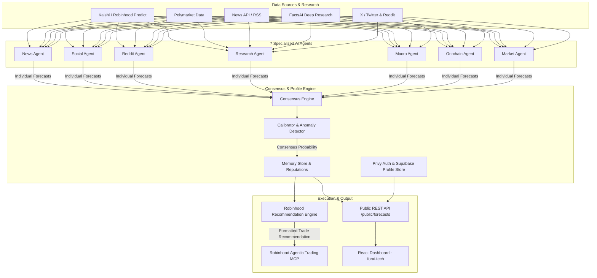

# 🔮 Forecast AI

### Open-Source Multi-Agent Intelligence Infrastructure for Prediction Markets

[](#)
[](#)
[](#)
[](https://forai.tech/)
[](https://forai.tech/dashboard)

<p align="center">
  <a href="https://railway.app/template/new?template=https://github.com/codebyollie/forecast-agents">
    
  </a>
  <a href="https://render.com/deploy?repo=https://github.com/codebyollie/forecast-agents">
    
  </a>
  <a href="https://codespaces.new/codebyollie/forecast-agents">
    
  </a>
</p>

---

**Forecast AI** is the open-source multi-agent intelligence infrastructure for Prediction Markets (Kalshi, Robinhood Predict, and Polymarket). It enables specialized autonomous AI agents to continuously monitor real-world events, aggregate multi-modal data, reason collaboratively, and generate explainable probability forecasts.

Instead of relying on a single static LLM, Forecast AI deploys **7 domain-specialized agents** (News, Social, Reddit, Research, Macro, On-chain, and Market Agents). A **Consensus Engine** aggregates their analysis into a calibrated probability forecast and formats trade recommendations for hand-off to your personal **Robinhood Agentic Trading MCP** (`https://agent.robinhood.com/mcp/trading`) session.

---

## 📚 Documentation Index

For detailed technical guides and module specifications, explore the [docs/](docs/) directory:

| Document | Description |
| :--- | :--- |
| [docs/agents.md](docs/agents.md) | Overview of specialized agents, roles, system prompts, and weightings. |
| [docs/architecture.md](docs/architecture.md) | High-level module architecture, data flows, and system boundaries. |
| [docs/consensus.md](docs/consensus.md) | Mathematical formulation of confidence weighting and Bayesian calibration. |
| [docs/deployment.md](docs/deployment.md) | Docker builds, Render deployment, and Railway hosting guides. |
| [docs/examples.md](docs/examples.md) | Python library usage, API server integration, and code snippets. |
| [docs/facts_ai.md](docs/facts_ai.md) | FactsAI Deep Research integration, setup, pricing, and error handling. |
| [docs/getting-started-keys.md](docs/getting-started-keys.md) | Configuring LLM providers, Privy auth, Supabase DB, and FactsAI keys. |
| [docs/kalshi.md](docs/kalshi.md) | Kalshi API client and Robinhood Predict market pricing proxy data. |
| [docs/memory.md](docs/memory.md) | Long-term memory storage, Brier scoring, and Bayesian reputation loops. |
| [docs/polymarket.md](docs/polymarket.md) | Read-only Polymarket Gamma and CLOB orderbook integration details. |
| [docs/providers.md](docs/providers.md) | LLM provider fallback chain (OpenAI, Gemini, Anthropic, OpenRouter, Ollama). |
| [docs/robinhood_agentic.md](docs/robinhood_agentic.md) | Robinhood Agentic Trading MCP integration guidelines and safety model. |
| [docs/sources.md](docs/sources.md) | Source connectors (News, RSS, Twitter, Reddit, Blockchain, Kalshi, FactsAI). |

---

## 🏗 System Architecture


```mermaid
graph TD
    subgraph Data Sources & Research
        kalshi[Kalshi / Robinhood Predict]
        poly[Polymarket Data]
        news[News API / RSS]
        factsai[FactsAI Deep Research]
        social[X / Twitter & Reddit]
    end

    subgraph 7 Specialized AI Agents
        A_News[News Agent]
        A_Social[Social Agent]
        A_Reddit[Reddit Agent]
        A_Research[Research Agent]
        A_Macro[Macro Agent]
        A_Onchain[On-chain Agent]
        A_Market[Market Agent]
    end

    subgraph Consensus & Profile Engine
        CE[Consensus Engine]
        Calibrator[Calibrator & Anomaly Detector]
        Memory[Memory Store & Reputations]
        Profile[Privy Auth & Supabase Profile Store]
    end

    subgraph Execution & Output
        RecEngine[Robinhood Recommendation Engine]
        MCP[Robinhood Agentic Trading MCP]
        API[Public REST API /public/forecasts]
        UI[React Dashboard - forai.tech]
    end

    kalshi & poly & news & factsai & social --> A_News & A_Social & A_Reddit & A_Research & A_Macro & A_Onchain & A_Market
    A_News & A_Social & A_Reddit & A_Research & A_Macro & A_Onchain & A_Market -->|Individual Forecasts| CE
    CE --> Calibrator
    Calibrator -->|Consensus Probability| Memory
    Memory --> RecEngine
    RecEngine -->|Formatted Trade Recommendation| MCP
    Memory --> API
    Profile --> API
    API --> UI
```

---

## 🔌 Data Sources & Market Integrations

Forecast AI integrates with primary prediction venues and intelligence providers:

1. **Kalshi (Robinhood Predict Proxy)**:
   - Kalshi's REST API (`https://api.elections.kalshi.com/trade-api/v2`) provides real-time event market pricing, orderbooks, and bid-ask spreads.
   - Serves as the primary pricing proxy for **Robinhood Predict** event contracts.

2. **Polymarket (Secondary, Read-Only)**:
   - Uses Polymarket's Gamma API (`https://gamma-api.polymarket.com`) and CLOB orderbook API (`https://clob.polymarket.com`) for secondary probability validation and orderbook depth inspection.

---

## ⚡ Execution Layer: Robinhood Agentic Trading MCP

Forecast AI includes a dedicated recommendation engine (`forecast_ai/robinhood_agentic/`) for hand-off to your personal **Robinhood Agentic Trading MCP** (`https://agent.robinhood.com/mcp/trading`):

- **Safety & Permissioning**: Forecast AI **never auto-trades without user permission**. It formats consensus probability outputs into structured, human-readable trade recommendation prompts (`BUY_YES`, `BUY_NO`, `HOLD`).
- **MCP Prompt Format**: Generates formatted action prompts specifying target contract ticker, recommended side, confidence score, and clear risk warnings.

---

## 🤖 LLM Providers & Automatic Fallback Chain

Forecast AI features an enterprise-grade LLM provider routing and automatic fallback system (`forecast_ai/providers/`):

- **Default Pair**: Primary **OpenAI** (`gpt-4o`) paired with **Google Gemini** (`gemini-flash-latest`).
- **Automatic Fallback Chain**: If the primary provider encounters rate limits (HTTP 429), quota exhaustion (HTTP 429/402), or server errors (HTTP 500+), the system automatically retries across backup providers without failing the forecast.
- **Supported Providers**: OpenAI, Google Gemini, Anthropic Claude, OpenRouter, and local Ollama.
- **Environment Variable Overrides**:
  - `OPENAI_API_KEY`
  - `GEMINI_API_KEY`
  - `ANTHROPIC_API_KEY`
  - `OPENROUTER_API_KEY`
  - `OLLAMA_API_BASE`

For details on configuring keys, see [docs/getting-started-keys.md](docs/getting-started-keys.md).

---

## 🌐 Public Read-Only Feed (`/public/forecasts`)

The backend exposes a public, CORS-enabled read-only REST API endpoint designed for integration with frontend dashboards ([forai.tech/dashboard](https://forai.tech/dashboard)):

- **Endpoints**:
  - `GET /public/forecasts`: Returns live consensus forecasts for 6 curated topics across crypto, macro, and tech.
  - `GET /public/forecasts/{topic_id}`: Returns detailed prediction breakdown for a specific topic.
  - `GET /healthz`: Health check endpoint.
- **Tiered Refresh Schedule**:
  - **Short-horizon topics** (Crypto/Tech): Refreshed every 2 hours.
  - **Long-horizon topics** (Macro/CPI): Refreshed every 6–12 hours.
- **Rate Limiting & Safety**: Public endpoints are rate-limited and protected by a monthly spend guard (`SERVER_PUBLIC_FEED_MONTHLY_BUDGET_USD`).

---

## 👤 User Profiles & $FORAI Holder Tiers

Forecast AI includes an account-scoped user profile system:

1. **Privy Server-Side Auth (`forecast_ai/api/auth.py`)**:
   - `GET /profile/me` is protected by a FastAPI dependency that verifies server-side Privy JWT tokens (`Authorization: Bearer <token>`).
   - Unauthenticated or expired tokens return HTTP 401.

2. **Supabase Postgres Profile Store (`forecast_ai/db/supabase_store.py`)**:
   - Profile data (privy user ID, linked email, wallet address, holder tier, $FORAI balance, badges, track-record status) is persisted in a hosted Supabase Postgres database.
   - Includes graceful fallback to an in-memory store for offline local dev/testing.

3. **$FORAI Token Holder Tiers (`forecast_ai/services/balance_checker.py`)**:
   - Performs EVM JSON-RPC `balanceOf` checks for the $FORAI token (`0xcc9c1ec224c3824ae5ea699ec72ef5fad4165e49`) over Robinhood Chain RPC (`https://rpc.robinhood.com`) with a 5-minute TTL cache:
     - ⚪ **Free Tier**: < 1,000 $FORAI
     - 🔵 **Holder Tier**: ≥ 1,000 $FORAI
     - 👑 **Pro Holder Tier**: ≥ 10,000 $FORAI

4. **Badges**:
   - Dynamically evaluates user badges: `"holder"`, `"pro_holder"`, and `"early_adopter"`.

> [!IMPORTANT]
> **CRITICAL CREDENTIAL DISTINCTION**:
> - **Backend Host (`forecast-agents`)**: Set `PRIVY_APP_ID` AND `PRIVY_APP_SECRET` in environment variables for server-side token verification.
> - **Frontend Website (`forecast-website`)**: Set `NEXT_PUBLIC_PRIVY_APP_ID` ONLY. **NEVER expose `PRIVY_APP_SECRET` on the frontend client!**

---

## 🔬 FactsAI Deep Research Integration

Forecast AI integrates with [Polyfactual](https://www.polyfactual.com/)'s [FactsAI Deep Research API](https://factsai.org/docs) (`forecast_ai/sources/facts_ai.py`):

- **Purpose**: Provides synthesized web research answers and verifiable source citations (`url` + `title`) to `ResearchAgent` and `MacroAgent`.
- **Feature Flag**: Disabled by default (`FACTSAI_ENABLED=false`). Enable by setting `FACTSAI_API_KEY` and `FACTSAI_ENABLED=true`.
- **Pricing & Cost Control**: Pay-per-request model ($0.012/request). Includes coarse refresh cadence options (`coarse_refresh_interval_cycles: 2`) to keep monthly usage within budget limits.
- **Graceful Fallback**: If FactsAI API returns 401, 402, 429, or 500 errors, the backend logs a warning and gracefully falls back to standard evidence without stopping forecasts.

For full setup guidelines and cost math, see [docs/facts_ai.md](docs/facts_ai.md).

---

## 🖥️ Full CLI Command Reference

All commands implemented in `forecast_ai/cli/main.py`:

```bash
forecast --help
```

| Command | Arguments / Flags | Description |
| :--- | :--- | :--- |
| `forecast setup` | None | Runs the interactive first-time setup wizard. |
| `forecast predict` | `<query>` `--market-id <id>` | Runs a one-shot multi-agent consensus forecast for a query. |
| `forecast recommend` | `<query>` `--market-id <id>` | Formats a forecast into a Robinhood Agentic MCP trade recommendation. |
| `forecast run` | `--category <cat>` `--no-server` | Launches surveillance watching loops and the FastAPI server. |
| `forecast watch` | `--category <cat>` `--interval <sec>` | Runs standalone market surveillance without launching the API server. |
| `forecast market` | `<slug>` | Inspects metadata, volume, liquidity, and orderbook depth for a Polymarket slug. |
| `forecast sources` | None | Lists all registered data sources (News, RSS, Twitter, Reddit, Blockchain, Kalshi, FactsAI). |
| `forecast agents` | None | Displays status (ENABLED/DISABLED), weights, and providers for all 7 agents. |
| `forecast providers` | None | Lists configured LLM providers (OpenAI, Gemini, Anthropic, Ollama, OpenRouter). |
| `forecast server` | None | Starts the FastAPI HTTP server manually on host/port. |

---

## 🚀 One-Click Cloud Deployment & Self-Hosting

### 1. One-Click Cloud Deploy
Deploy `forecast-agents` to Render or Railway:

<p align="center">
  <a href="https://railway.app/template/new?template=https://github.com/codebyollie/forecast-agents">
    
  </a>
  <a href="https://render.com/deploy?repo=https://github.com/codebyollie/forecast-agents">
    
  </a>
</p>

### 2. One-Line Automated Installer
Run the automated installer on Linux/macOS/WSL:
```bash
curl -sSL https://raw.githubusercontent.com/codebyollie/forecast-agents/main/install.sh | bash
```

### 3. GitHub Codespaces
Click **Open in GitHub Codespaces** to launch a pre-configured devcontainer ready for development.

For API key setup details, see [docs/getting-started-keys.md](docs/getting-started-keys.md).

---

## 👥 Community & Links

- **Website**: [forai.tech](https://forai.tech/)
- **Dashboard**: [forai.tech/dashboard](https://forai.tech/dashboard)
- **GitHub**: [codebyollie/forecast-agents](https://github.com/codebyollie/forecast-agents)
- **Render Service**: [forecast-agents.onrender.com](https://forecast-agents.onrender.com/)

---

## 🛡 License

Forecast AI is open-source software licensed under the **Apache 2.0 License**.
