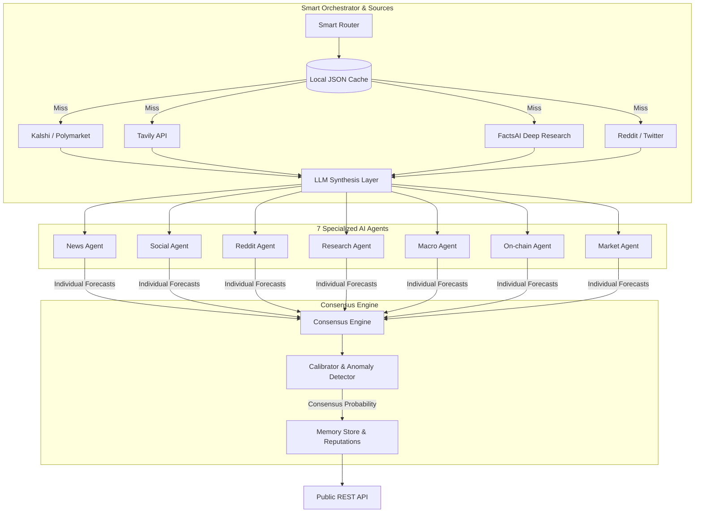

# 🔮 Forecast AI

### Open-Source Multi-Agent Intelligence Infrastructure for Prediction Markets

**Powered by $FORAI CA: 0xcc9c1ec224c3824ae5ea699ec72ef5fad4165e49**

[](#)
[](#)
[](#)

<p align="center">
  <a href="https://railway.app/template/new?template=https://github.com/codebyollie/forecast-agents">
    
  </a>
  <a href="https://render.com/deploy?repo=https://github.com/codebyollie/forecast-agents">
    
  </a>
</p>

---

**Forecast AI** is a fully open-source, BYOK (Bring-Your-Own-Keys) multi-agent intelligence infrastructure for Prediction Markets (Kalshi, Robinhood Predict, and Polymarket). It enables specialized autonomous AI agents to continuously monitor real-world events, aggregate multi-modal data, reason collaboratively, and generate explainable probability forecasts.

Instead of relying on a single static LLM, Forecast AI deploys **7 domain-specialized agents** (News, Social, Reddit, Research, Macro, On-chain, and Market Agents). A **Consensus Engine** aggregates their analysis into a calibrated probability forecast and formats trade recommendations for hand-off to your personal **Robinhood Agentic Trading MCP** session.

---

## 🚀 Quick Setup Guide

Forecast AI is designed to be hosted on your own infrastructure using your own API keys. 

### 1. Clone & Install
```bash
git clone https://github.com/codebyollie/forecast-agents.git
cd forecast-agents
python -m venv venv
source venv/bin/activate  # On Windows: venv\Scripts\activate
pip install -r requirements.txt
```

### 2. Configure Environment (Bring-Your-Own-Keys)
Copy the example environment file:
```bash
cp .env.example .env
```
Open `.env` and add your required API keys. You can use any combination of LLM providers and Data APIs:
* **LLMs**: `OPENAI_API_KEY`, `ANTHROPIC_API_KEY`, `GEMINI_API_KEY`, or `OLLAMA_API_BASE`
* **Data Sources**: `TAVILY_API_KEY`, `FACTSAI_API_KEY`, `NEWS_API_KEY`, `TWITTER_BEARER_TOKEN`

### 3. Run the CLI or Server
Run an interactive setup wizard to verify your keys:
```bash
forecast setup
```
Or immediately start the API server and market surveillance loop:
```bash
forecast run --category crypto
```

---

## 🏗 System Architecture & Smart Orchestration

Forecast AI features a state-of-the-art **Smart Orchestrator** to prevent API spam and reduce costs:

1. **Smart Routing**: The `SourceManager` dynamically routes queries to the correct APIs. (e.g., deep research queries hit FactsAI + Tavily; crypto queries hit Blockchain + News).
2. **Local Caching**: All API responses are cached locally with a TTL mechanism so that 7 agents querying similar data only trigger a single API charge.
3. **Synthesis Layer**: Raw search results are synthesized, deduplicated, and fact-checked by a lightweight LLM *before* being handed to the Agent cluster.


```mermaid
graph TD
    subgraph Smart Orchestrator & Sources
        Router[Smart Router]
        Cache[(Local JSON Cache)]
        Synth[LLM Synthesis Layer]
        
        Router --> Cache
        Cache -->|Miss| kalshi[Kalshi / Polymarket]
        Cache -->|Miss| tavily[Tavily API]
        Cache -->|Miss| factsai[FactsAI Deep Research]
        Cache -->|Miss| social[Reddit / Twitter]
        
        kalshi & tavily & factsai & social --> Synth
    end

    subgraph 7 Specialized AI Agents
        A_News[News Agent]
        A_Social[Social Agent]
        A_Reddit[Reddit Agent]
        A_Research[Research Agent]
        A_Macro[Macro Agent]
        A_Onchain[On-chain Agent]
        A_Market[Market Agent]
    end

    subgraph Consensus Engine
        CE[Consensus Engine]
        Calibrator[Calibrator & Anomaly Detector]
        Memory[Memory Store & Reputations]
    end

    Synth --> A_News & A_Social & A_Reddit & A_Research & A_Macro & A_Onchain & A_Market
    A_News & A_Social & A_Reddit & A_Research & A_Macro & A_Onchain & A_Market -->|Individual Forecasts| CE
    CE --> Calibrator
    Calibrator -->|Consensus Probability| Memory
    Memory --> API[Public REST API]
```

---

## 🤖 LLM Providers & Automatic Fallback Chain

Forecast AI features an enterprise-grade LLM provider routing and automatic fallback system:

- **Default Pair**: Primary **OpenAI** (`gpt-4o`) paired with **Google Gemini** (`gemini-flash-latest`).
- **Automatic Fallback Chain**: If the primary provider encounters rate limits (HTTP 429), quota exhaustion (HTTP 429/402), or server errors (HTTP 500+), the system automatically retries across backup providers without failing the forecast.
- **Supported Providers**: OpenAI, Google Gemini, Anthropic Claude, OpenRouter, and local Ollama.

---

## 🖥️ Full CLI Command Reference

All commands are implemented in `forecast_ai/cli/main.py`:

| Command | Arguments / Flags | Description |
| :--- | :--- | :--- |
| `forecast setup` | None | Runs the interactive first-time setup wizard. |
| `forecast predict` | `<query>` `--market-id <id>` | Runs a one-shot multi-agent consensus forecast for a query. |
| `forecast run` | `--category <cat>` | Launches surveillance watching loops and the FastAPI server. |
| `forecast watch` | `--category <cat>` | Runs standalone market surveillance without launching the API server. |
| `forecast sources` | None | Lists all registered data sources (Tavily, FactsAI, Reddit, News, etc.). |
| `forecast agents` | None | Displays status (ENABLED/DISABLED), weights, and providers for all 7 agents. |
| `forecast providers` | None | Lists configured LLM providers. |
| `forecast server` | None | Starts the FastAPI HTTP server manually on host/port. |

---

## 🛡 License

Forecast AI is open-source software licensed under the **Apache 2.0 License**.
